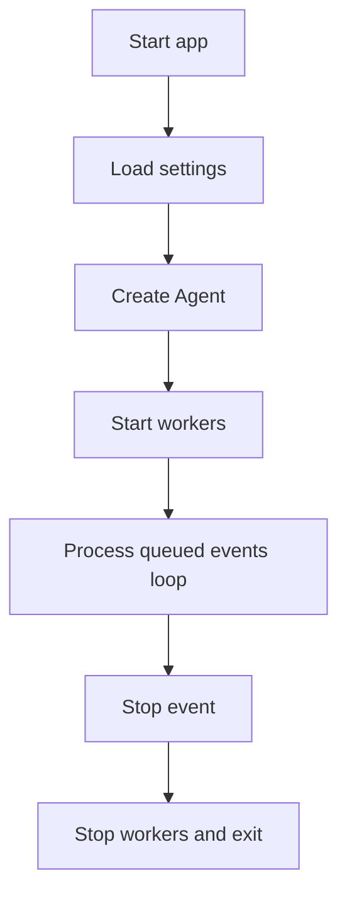
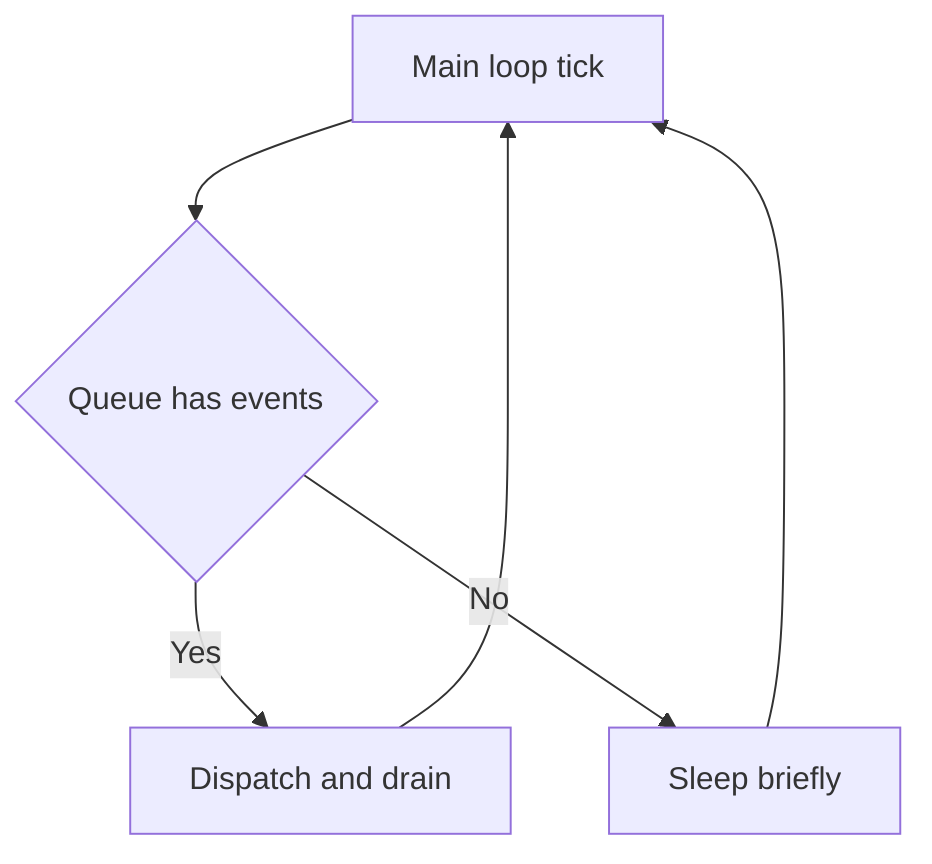
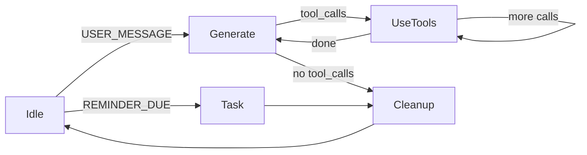
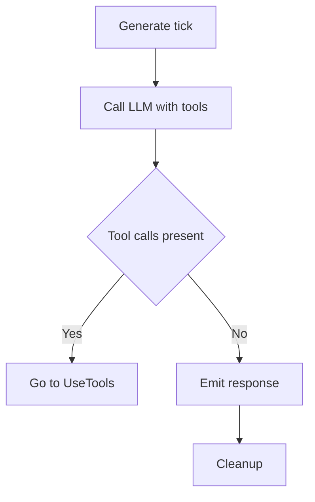
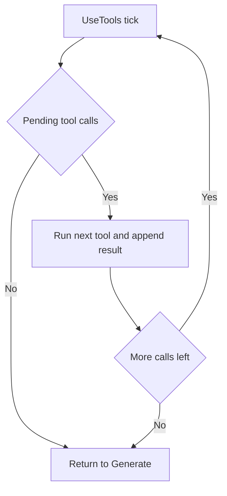
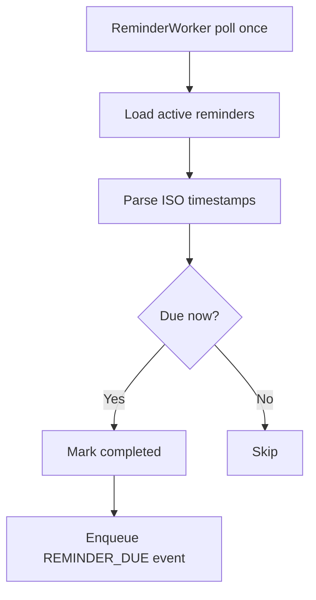
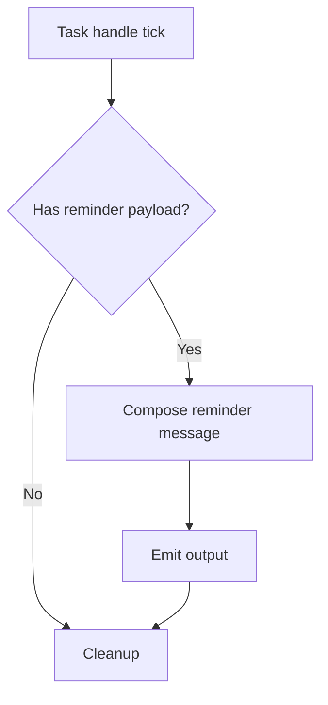
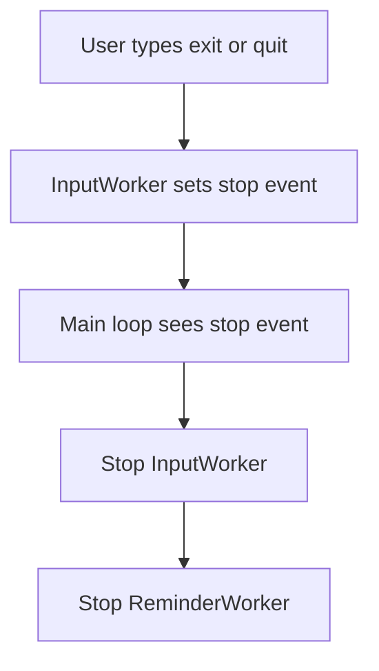

# Execution Flow

This document explains the end-to-end execution flow with high-level steps
and visual flow charts. It is kept aligned with the current codebase.

## Startup and Runtime Overview

### Startup steps

1. `load_settings()` loads config with precedence: env > local.toml > default.toml
2. `Agent` initializes the state machine and tool registry
3. System instructions are loaded via `ContextBuilder`
4. Workers start:
   - `InputWorker` reads user input and enqueues events
   - `ReminderWorker` polls the DB and enqueues due reminders
5. The main loop drains the event queue

## Event Processing Loop

## State Machine Flow

## Generate and Tool Execution

## Reminder Flow

## Shutdown

## Notes and Invariants

- The state machine only advances on `TICK` events during `drain()`.
- Tool calls are executed in order; the model may request multiple calls at once.
- System instructions are loaded from config/system.md if non-empty, otherwise
  config/default_system.md.
- Reminder deletions and scheduling are grounded in the SQLite database.
